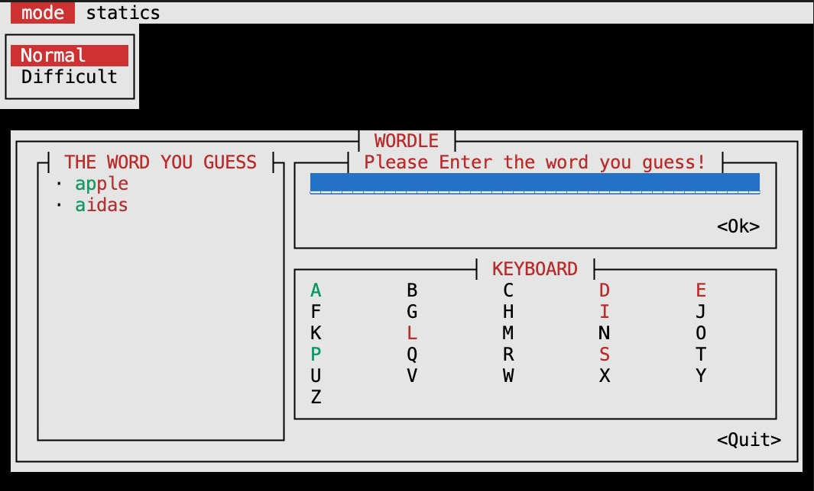
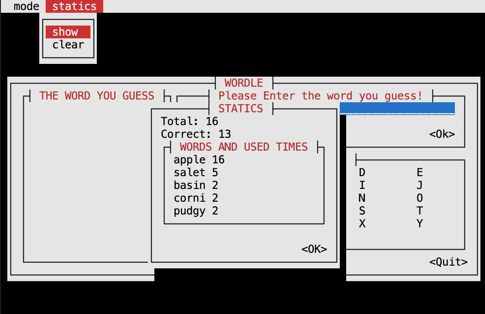

# Wordle_ui
本项目是2022年清华大学计算机系夏季学期程序设计训练（Rust）课程大作业Wordle的一部分，是自制的Wordle游戏的简易UI。原版Wordle游戏详见[Wordle](https://wordlegame.org)。

## 界面说明和功能介绍



如图，整个界面由5部分组成:
 * 上方菜单栏
 * 本局用过的单词及状态列表`THE WORD YOU GUESS`
 * 右上方输入框及`Ok`按钮
 * 键盘状态区`KEYBOARD`
 * 右下角`Quit`按钮

上方菜单mode可以选择`Normal`和`Difficult`两种模式:
 * `Normal`模式下新的猜词中可以任选词；
 * `Difficult`模式下新的猜测中所有位置正确（绿色）的字母不能改变位置，也必须用到所有存在但位置不正确（黄色）的字母，没有其他要求。

上方菜单`statics`可以选择展示(`show`)统计数据和清空(`clear`)统计数据,如下图:



其余部分与原版Wordle游戏相同。

## 运行方式

配置好Rust运行环境后，克隆仓库到本地，在项目的根目录下运行
```bash
cargo run
```
用到的库详见`Cargo.toml`文件的`[dependencies]`字段。